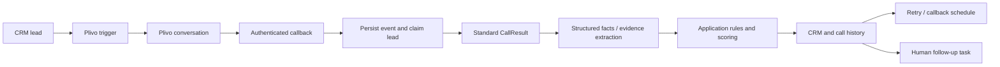

# Lead qualification engine

Plivo conducts voice conversations. Arevei owns call outcomes, qualification,
scores, temperature, retries, next actions and CRM updates. AI extracts transcript
facts with evidence; provider or LLM scores and final labels cannot override rules.

## Architecture

The existing manual, demo and Google Sheets lead creation paths, CRM, database,
authentication, Plivo configuration, call history and scheduler are reused.

| Component | Implementation |
| --- | --- |
| PlivoCallTriggerService | `qualification_service.py`: serializes triggers, invokes existing transport in `plivo_calls.py` |
| PlivoWebhookController | Authenticated `server.py` routes delegate to `qualification_service.py` for event claims and processing |
| PlivoResponseAdapter | `plivo_response_adapter.py`: native, wrapped JSON and Contacto payloads become `CallResult` |
| CallOutcomeClassifier | `qualification_engine.py`: provider-independent outcome classification |
| QualificationRuleEngine | Deterministic mandatory, disqualifying and additional rules |
| QualificationScoringEngine | Configurable weighted scoring |
| LeadTemperatureEngine | Score bands with rule priority |
| RetryPolicyEngine | Retry eligibility and configured delays |
| NextActionEngine | Outcome/profile-driven action selection |
| LeadQualificationEngine | Coordinates classification, rules and scoring |
| CRMLeadUpdateService | Existing leads, notes, sessions, history and task updates |



## Visual configuration and migration

Open **AI Agents → Lead Qualification → Configure qualification**, or
**CRM settings → Open qualification profiles**. Route:
`/app/w/<workspace-id>/qualification`.

1. Create a product/service profile, optionally tied to a campaign ID.
2. Enter price/currency, service locations, required facts and comparison rules.
3. Configure weights, thresholds, actions, attempt limits and retry delays.
4. Preview sample facts. Preview makes no AI request, call, task or CRM change.
5. Save the profile, optionally as the workspace default.
6. Each CRM lead can override the profile for its next call.

Selection: **lead override → campaign → workspace default**. A call keeps the
selected profile snapshot. Manual lead creation accepts `campaign_id`; the profile
assignment API also supports overrides. The trigger base payload exposes
`qualification_profile` for an optional Plivo input-variable mapping. Configure
the external flow to accept it if it needs product-specific questions; Arevei
does not automatically rewrite or deploy the voice flow.

Old `ai_qualification_config` text rules are preserved under **Previous rules to
review**. Recreate them as explicit comparisons and save a default profile. They
are not silently translated or applied by the new engine. Without a selected
profile, connected calls remain `PARTIALLY_QUALIFIED`, with
`qualification_profile_configuration` missing. Outcome classification, DND and
existing workflow retry delays still work. Existing customer leads are not
reclassified or backfilled.

Lead details show call outcome and lead status separately, score, temperature,
confidence, attempts, missing information, next action, facts and call history.
Processing/failure messages are separate from the last saved result. An open lead
refreshes every six seconds while its browser tab is visible, including after
transport completion so late transcripts can appear.

## Rules and scores

Rules use `{field, operator, value, reason}`. Supported operators: `eq`, `ne`,
`gte`, `lte`, `gt`, `lt`, `contains`, `in`, `exists`. Numeric comparisons require
numeric values; `in` requires a list. Nested paths such as `budget.value` and
`attributes.seats` support different industries. Strings compare without case;
service locations use exact matching. `special_rules` are additional mandatory
rules. Unknown information stays null and requires review when critical.

Example profile (omitted fields use defaults):

```json
{
  "product_name": "Team software subscription",
  "product_description": "Collaboration software for teams",
  "target_customer": "Teams with at least ten users",
  "campaign_id": "team-software-launch",
  "price_range": {"min": 500, "max": null, "currency": "USD"},
  "mandatory_qualification_criteria": [
    {"field": "attributes.seats", "operator": "gte", "value": 10,
     "reason": "At least ten users are required"}
  ],
  "required_information": ["product_fit", "buying_intent", "purchase_timeline"],
  "desired_next_action": "BOOK_DEMO",
  "retry": {
    "max_attempts": 4,
    "retry_rules": [
      {"outcome": "NO_ANSWER", "delay_minutes": 60},
      {"outcome": "BUSY", "delay_minutes": 30}
    ]
  }
}
```

| Outcome | Lead status | Behavior |
| --- | --- | --- |
| INVALID_NUMBER, WRONG_NUMBER, DUPLICATE_OR_SPAM | JUNK | No retry |
| NO_ANSWER, BUSY, SWITCHED_OFF, UNREACHABLE, TECHNICAL_ISSUE, DROPPED_CALL | PENDING | Retry eligible until attempt limit |
| CALLBACK_REQUESTED | PENDING | Schedule callback or create a human task if scheduling is unavailable/time is unknown |
| DND_REQUESTED | UNQUALIFIED | Block future calls and cancel pending engine follow-ups |
| CONNECTED | Evaluate facts/rules | Partial, unqualified, qualified or sales-ready |

Not interested is unqualified, not junk. Unanswered calls do not become
unqualified simply because they were unanswered. Failed mandatory rules block
qualification and suppress temperature even if the score is high. Missing
mandatory information also suppresses temperature pending review.

Default weights: product fit 25, budget/eligibility 20, intent 25, timeline 20,
decision readiness 10. Weights must total 100. Default factors:

- Product fit: true earns full weight; optional fit criteria can determine it.
- Eligibility: true earns full weight. If unknown, a known affordable budget can
  earn the weight when a minimum price is configured. No currency conversion.
- Intent high/medium/low: 100% / 60% / 20%.
- Timeline immediate/soon/later: 100% / 75% / 25%.
- Decision maker/shared/not decision maker: 100% / 50% / 0%.

Optional API `scoring_rules` map a dimension to a comparison; a match earns its
full weight. Confidence measures known/extracted information, independently of
readiness. Missing critical information reduces confidence. No meaningful
conversation or qualification facts means no score.

Temperature: 0–29 LOW, 30–49 COLD, 50–69 WARM, 70–84 HOT, 85–100 VERY_HOT.
Qualification defaults to 50+; sales-ready to 85+, after required rules pass.

## Actions, persistence and recovery

Retries use the profile intervals and existing scheduler, workflow enable switch
and calling window. An eligible outcome with no delay does not automatically
retry. Maximum attempts include saved sessions without callbacks. Manual calls
remain operator-controlled; DND and junk block both manual and automatic calls.
Trigger timeouts retain the existing reconciliation behavior.

SALES_CALL, SITE_VISIT, BOOK_DEMO, SEND_QUOTATION and FOLLOW_UP create **human
handoff tasks**, not claims that those actions already occurred. Tasks are visible
without a growth roadmap. Open CRM to perform the action, then **Mark done**.
The AI task runner cannot execute these handoffs. Superseded pending actions are
cancelled; DND cancels all pending engine follow-ups for that lead.

Only `qualification_profiles` is a new collection. Existing `crm_leads`,
`plivo_call_events`, `crm_call_logs`, `plivo_call_sessions`, tasks and workflow
configuration are reused. Startup adds campaign uniqueness and history indexes.
The sales-pipeline `status` remains separate from `lead_status`; older CRM/demo
compatibility fields remain populated. No destructive migration is required.

Raw events are retained with credential fields redacted. The normal history API
omits raw provider payloads. Stable event IDs prevent exact duplicate processing;
lead leases serialize events/triggers across workers. Concurrent events receive
503 and `Retry-After: 5`. Decisions are saved before side effects; deterministic
note/task IDs prevent duplication after an interrupted write. Request/call UUID
aliases share a session history. Late known-call results preserve the active
call's CRM decision; DND remains effective even when late.

AI extraction is bounded by a timeout. If it fails, structured facts remain
usable and incomplete information requires review. There is no new durable job
queue: configure provider webhook retries. Failed events remain auditable and
can be resent through the authenticated endpoint.

## Callback authentication

Native status/recording callbacks retain Plivo V3 validation using
`PLIVO_AUTH_TOKEN` and `PUBLIC_BASE_URL`. Keep `PLIVO_VALIDATE_SIGNATURE=true`
outside deliberate local testing. Qualification-result/global agent callbacks
require `PLIVO_AGENT_CALLBACK_TOKEN` through Bearer, `x-arevei-webhook-token`, or
query `token`; if absent, a valid Plivo V3 signature is required. An empty token
no longer leaves qualification endpoints public.

The current local environment has no shared callback token. If the Plivo AI flow
sends unsigned JSON, configure the same random token in the backend environment
and its callback request. No external Plivo settings were changed automatically.
The UI shows the configured authentication mode, not proof of live delivery.

Outcome mappings follow Plivo's [hangup causes](https://www.plivo.com/docs/voice/troubleshooting/hangup-causes).
See its [callback documentation](https://www.plivo.com/docs/voice/concepts/callbacks).

## API and verification

Verified locally: 123 targeted backend tests, 9 frontend tests and the production
frontend build passed. The running backend serves the new routes; an authenticated
preview in the Arevei workspace rejected an unaffordable lead despite a high
score, and the frontend route returned HTTP 200. No browser automation or live
Plivo call was performed. The workspace currently has no saved qualification
profile, so its product rules still need to be configured in the new UI.

Follow-up verification fixed delayed recording updates when Plivo's request UUID
and call UUID refer to the same session, and profile selection during CRM refresh.
Retrying a failed workspace-default update now edits the already-saved profile
instead of creating another. The five Mongo/API integration tests passed again.
The workspace audit found two processed engine callback events, no failed or
processing events, and no saved profile. This confirms processing activity, not
that a complete voice conversation has been tested end to end.

All configuration routes use existing workspace authorization. Base:
`/api/workspaces/{ws_id}/crm/qualification`.

| Method | Path | Purpose |
| --- | --- | --- |
| GET / POST | `/profiles` | List/template or create |
| PUT | `/profiles/{profile_id}` | Update |
| POST | `/profiles/{profile_id}/default` | Workspace default |
| PUT | `/leads/{lead_id}/profile` | Override; null clears it |
| GET | `/leads/{lead_id}/history` | Latest 100 call decisions |
| POST | `/preview` | Evaluate `{profile, call}` without writes |

```powershell
.\.venv\Scripts\python.exe -m pytest backend/tests/test_qualification_engine.py backend/tests/test_qualification_integration.py backend/tests/test_plivo_calls.py backend/tests/test_llm_mantle.py backend/tests/test_crm_embedded_payment_plan.py -q
cd frontend
npm test -- --watchAll=false --runInBand
npm run build
```

Tests cover every requested outcome, missing data, mandatory failures, score
bands, AI/rule conflicts, duplicates, concurrent events, interrupted writes,
snapshots, aliases, late results, DND, tenant isolation, profile CRUD, preview and
webhook authentication. Mongo tests create synthetic records in uniquely named
temporary databases and delete only those databases. No real voice calls or
customer lead writes are used. Frontend tests cover result visibility, DND/errors
and failed assignment. The older deployed-preview lead-connector suite depends
on an external preview URL and live AI workspace creation and is outside this
isolated verification. Live Plivo delivery remains an account integration check.
